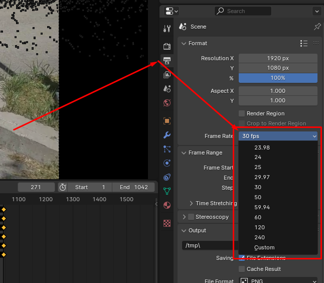
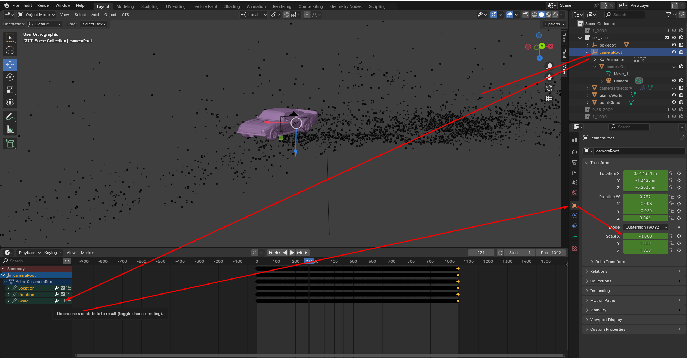
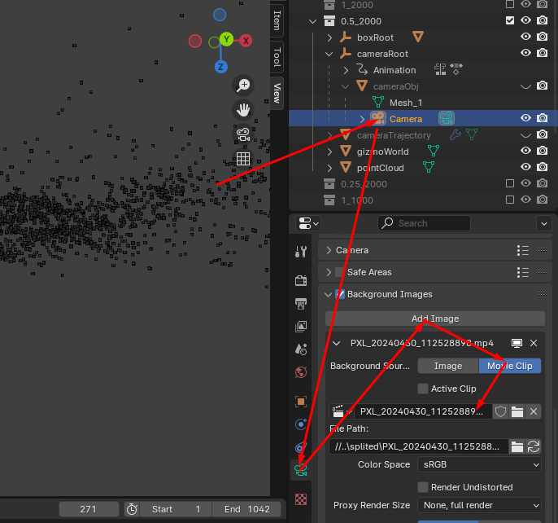
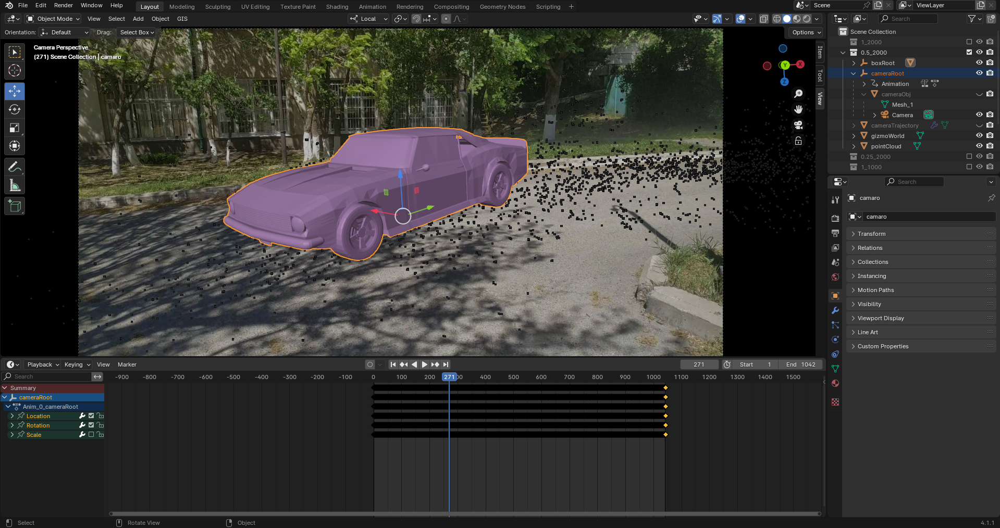
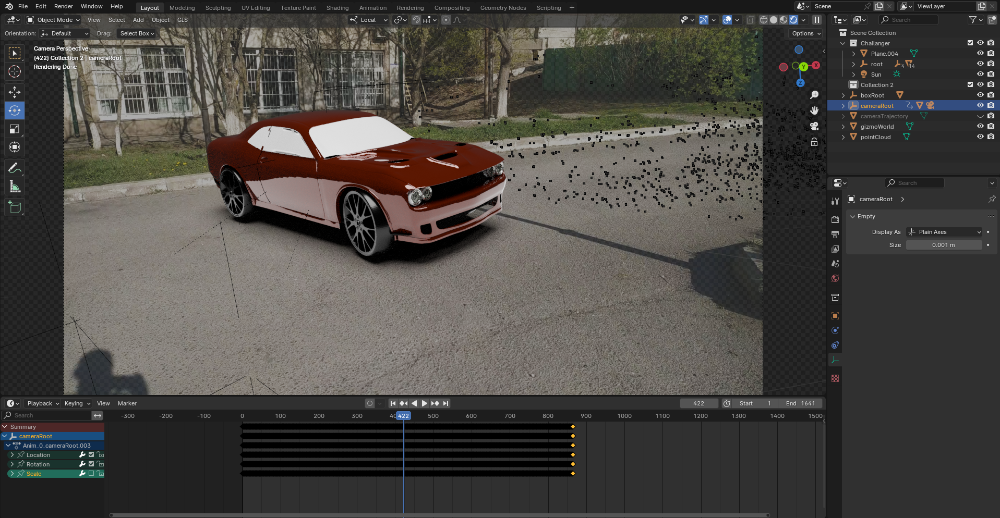

# SLAM3D-Video

Mobile application to 3D track camera trajectory using SLAM.
Recreated scene can be exported into glTF file and opened in more specialized software e.g. Blender
In order to ORB_SLAM3 work properly, provide correct intrinsic camera parameters.
There are plans to add autocalibration in the future

## Showcase
### Object insertion 
Left side is original + reprojected

Right side is recreated scene

Scene recreation timelapse 

## Dependencies
- [ORB_SLAM3](https://github.com/UZ-SLAMLab/ORB_SLAM3/)
- [OpenCV for Android](https://opencv.org/android/)
- Boost (1_72_0)
- openssl (1.0.2s)
- [filament, filamat, filament-uitls](https://github.com/google/filament)
- [JglTF](https://github.com/javagl/JglTF)

## Build
Regular Android studio project build (CMAKE required)

## Blender import
In order to properly import glTF scene in to blender some thing need to be done:
- Before import glTF file, make sure that you've setup right scene framerate. (it must be equal to fps of original video)
  
  
- After import glTF file into blender
- Setup scene. Select "cameraRoot" object, uncheck scale keyframes. Then open "Object proeprty" and on "Transform" tab set X scale to -1
  
  
- Setup camera background

  
- View through camera
  
  
- Change scene whatever you like
  
  

